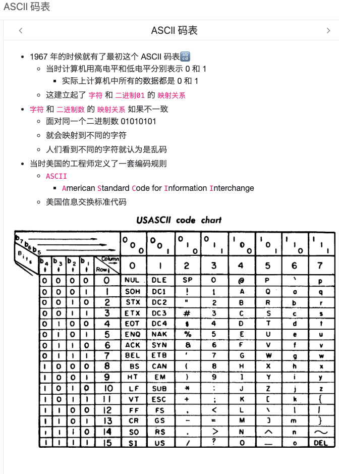
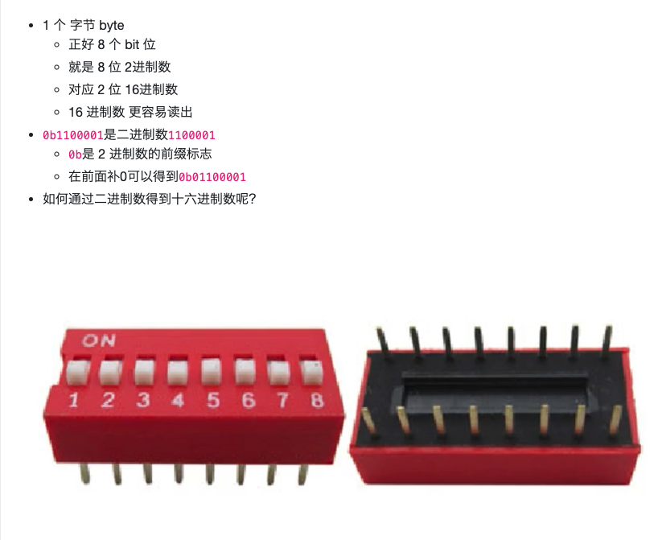

# paly python

## 20220714
1. encode && decode
   'a'.encode('ascii') => b'a'  type(b'a') => class bytes
2. 0b 0 主要表示其他进制的数（和 10 进制区分）b 表示二进制 x 表示 16 进制
3. ascii 字符
4. bin(n) hex(n) int(n)
5. vim 小技巧
   : 表示进入命令模式 :w 保存 :wq 保存并退出 
   :! 表示可以执行外部命令 :!wq 强制退出 :!python3 oeasy.py 执行外部 oeasy.py 文件 :!echo %  %表示当前的文件名
   
   > :%!xxd 我们可以看到这个文件的二进制形态
   > %是指的对于所有行的范围
   > !是执行外部命令
   > xxd指的是转化为 16 进制形式
   > :xxd –r 可以还原回去
6. 文件编码 可以看到文件是以 2 进制的方式存储的
7. 10 0x0A 对应 LF  Line Feed 喂一行 ？ 即换行
## 20220712
1. help() 函数从 命令行模式切换到 帮助模式
2. ASCII 码表 American Standard Code for Information Interchange 美国信息交换标准代码
   sudo apt-get install ascii 
   128 位 代表不同符号的编码

   
3. 0b 开头表示二进制数
   bin(ord('a')) => 0b1100001 
4. 对应关系：二进制数在计算机中是存储在字节中的
   
   

   1 个字节 byte = 8 个 bit位 （物理地址） 
   1B = 8bit (也就是 8 位二进制数 0 / 1)

   8 bit 能表示 2^8 个状态也就是 256 位 
   一位 16 进制数可以表示 16 中状态，两位就能表示 16*16 256 种状态

   一字节 等于 8 位 2 进制数表示的状态长度 
   一字节 等于 2 位 16 进制数表示的状态长度
5. 0x 开头表示十六进制数

   hex(ord('a')) => '0x61'
## 20220711
1. quit() 或者 ctrl + d 退出 IDEL 
2. REPL read evaluate print loop 
3. python 中的所有代码 大小写敏感
4. GPL 又称为 copyleft 许可证和 copyright 对应
5. 源代码的开放是发展的趋势，这样的个人软件开发者主导的项目依靠人民战争战胜了软件巨头 
   open source / open hardware
6. 时代的洪流最早是从水滴开始的
7. 使用 pdb 进行调试 也就是 python debug
   pdb3 guido.py
8. 历史上第一个程序错误是因为电脑里面飞进来了一直虫子 bug ?
9. python3  an interpreted, interactive, object-oriented programming language
10. python 3.10.4 构建了一个运行时环境 可以将 python 语句翻译成当前物理架构可执行的代码

